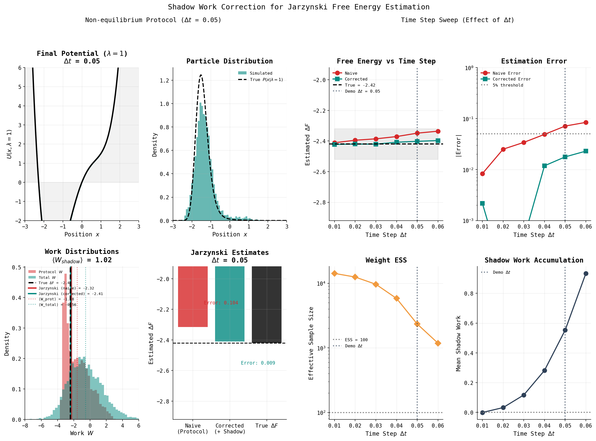
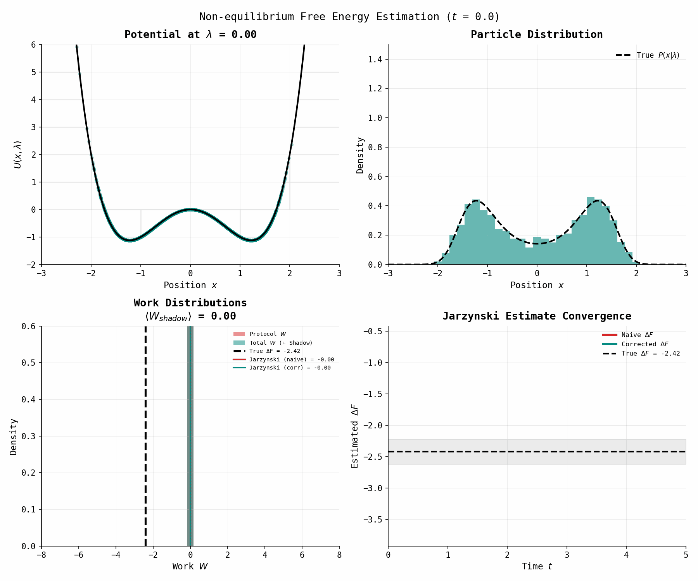

# Nonequilibrium Work Simulations & Notes

This repository contains simulations and notes exploring non-equilibrium thermodynamics, work relations, and shadow work.

## Structure

- `src/noneq/`: Core package for energy functions, integrators, and estimators.
- `notes/`: Theoretical background and paper summaries.
- `scripts/`: Simulation scripts and visualization notebooks.

## Demos

### Jarzynski & Crooks Fluctuation Theorems


### Shadow Work Correction for Free Energy Estimation

Using shadow work to correct Jarzynski free energy estimates at large time steps:



Key insight: The Jarzynski estimate uses exponential averaging, not arithmetic mean. The solid lines show Jarzynski estimates $\Delta F = -k_BT \ln \langle e^{-\beta W} \rangle$, while dotted lines show arithmetic means $\langle W \rangle$ (which always overestimate ΔF by the second law).



### Shadow Work & Equilibrium Debiasing

Demonstrating how finite-timestep discretization bias can be corrected using shadow work importance weights (based on [Sivak et al., 2013](https://arxiv.org/pdf/1107.2967)).


### Computational-Thermodynamic Trade-off

With a fixed compute budget (number of steps), there's an optimal protocol duration that minimizes total work:


## Key References

- [Sivak et al., 2011 (Shadow Work)](https://arxiv.org/pdf/1107.2967)
- [Jarzynski, 1997](https://arxiv.org/pdf/cond-mat/9610209)
- [Crooks, 1999](https://arxiv.org/pdf/cond-mat/9901352)
- [Sivak & Crooks, 2012 (Thermodynamic metrics)](https://arxiv.org/pdf/1201.4345)

## Installation

```bash
pip install -e .
```

## Running the Demo

To run the simulation and regenerate the animation:

```bash
python scripts/demo_fluctuation_theorems.py
```

